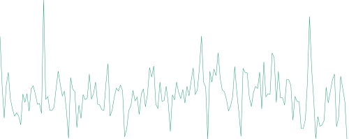

<p align="center">
  
<p>

<h1><p align="center">node-sparkline<p></h1>

<p align="center">
  A lightweight and zero-dependencies pure Node.js sparkline generator.
<p>

# Table of Contents
- [Presentation](#presentation)
- [Installation](#installation)
- [Technical information](#technical-information)
  - [Node.js](#nodejs)
  - [Debugging](#debugging)
  - [Tests](#tests)
    - [Linting](#linting)
    - [Unit](#unit)
- [Usage](#usage)
  - [Library](#library)
    - [Import node-sparkline](#import-node-sparkline)
    - [sparkline(options)](#sparklineoptions)
    - [Examples](#examples)
  - [Environment variables](#environment-variables)
  - [Errors](#errors)
    - [Object structure](#object-structure)
    - [Codes](#codes)
- [Development](#development)
- [Licence](#licence)

# Presentation

*node-sparkline* is a sparkline generator written in pure Node.js using ES6 and ES7 features with no dependency. It calculates points based on values to finally generate a polyline in a pure SVG (Scalable Vector Graphics) format. These values could be prices during the last 7 fays for an example.

The aim of this project is to provide a very simple, lightweight, zero-dependency, fast and **fully-tested** sparkline generator in SVG format and let user tune height, width, stroke color, stroke width and stroke opacity.

# Installation

`npm install node-sparkline`

`npm i -S node-sparkline`

# Technical information

## Node.js

- Language: JavaScript ES6/ES7
- VM: Node.js >=10.0.0

## Debugging

- Own debugger embedded that writes on *process.stderr* when the *DEBUG* environment variable is set. See [Environment variables](#environment-variables).

## Tests

Command to run all tests:

`npm test`

### Linting

ESLint with Airbnb base rules. See [Airbnb JavaScript Style Guide](https://github.com/airbnb/javascript).

`npm run test:lint`

### Unit

Mocha and Chai.

`npm run test:unit`

# Usage

## Library

### Import node-sparkline

*node-sparkline* module exports one function named *sparkline*.

```javascript
const sparkline = require('node-sparkline');
```

### sparkline(options)

  - `options`**<Object\>**:
    - `values`* **<Array\>** An array of values to draw the sparkline.
    - `width` **<Number\>** The width in pixels to fix for the generated SVG. *Default*: `135`
    - `height` **<Number\>** The height in pixels to fix for the generated SVG. *Default*: `50`
    - `stroke` **<String\>** The stroke color. An hexadecimal value or one of these [generic names](lib/helpers/color.js). *Default*: `#57bd0f`
    - `strokeWidth` **<Number\>** The stroke width in pixels. *Min*: `0` *Default*: `1.25`
    - `strokeOpacity` **<Number\>** The stroke opacity. *Min*: `0` *Max*: `1` *Default*: `1`

  - Returns: **<String\>** The SVG tags of the generated SVG image
  - Throws: **<InputError\>**

### Examples

You can find examples here: [doc/examples](doc/examples)

In these examples please prefer a well-known and tested asynchronous logger over the use of *console* module.

```javascript
const sparkline = require('node-sparkline');
const values = require('./values'); // values is an array

try {
  const svg = sparkline({
    values,
    width: 135,
    height: 50,
    stroke: '#57bd0f',
    strokeWidth: 1.25,
    strokeOpacity: 1,
  });

  // svg is a string with SVG + polyline tags
  // ...
} catch (e) {
  console.error(e.toString());
}
```




## Environment variables

- **DEBUG**: used to debug *node-sparkline*.

  Examples:
  - `DEBUG=node-sparkline:*` will debug all *node-sparkline* modules that could use the debugger.
  - `DEBUG=-node-sparkline:*` will disable debugging any *node-sparkline* modules that could use the debugger.
  - `DEBUG=*` will debug all *node-sparkline* modules that could use the debugger plus other modules used in your project if they use an equivalent debugger.

## Errors

### Object structure

Errors emitted by *node-sparkline* inherit the native Error prototype.

```javascript
{
  name,
  code,
  message,
  stack,
  toString(),
}
```

### Codes

<table style="text-align: center; vertical-align: center">
  <tr>
    <th style="text-align: center;">name</th>
    <th style="text-align: center;">code</th>
    <th style="text-align: center;">description</th>
    <th style="text-align: center;">module</th>
  </tr>

  <tr>
    <td rowspan="4"><i>InputError</i></td>
  </tr>

  <tr>
    <td>MISSING_VALUES</td>
    <td>The values to draw the sparkline are missing.</td>
    <td>lib/index</td>
  </tr>

  <tr>
    <td>INVALID_VALUES</td>
    <td><i>values</i> parameter must be an array.</td>
    <td>lib/index</td>
  </tr>
</table>

# Development

All contributions are greatly welcome :)

Please follow Git flow, ES6/7, ESLint Airbnb base rules.

# Licence

*node-sparkline* is released under the MIT license.

Copyright (C) 2020 Adrien Valcke

Permission is hereby granted, free of charge, to any person obtaining a copy of this software and associated documentation files (the "Software"), to deal in the Software without restriction, including without limitation the rights to use, copy, modify, merge, publish, distribute, sublicense, and/or sell copies of the Software, and to permit persons to whom the Software is furnished to do so, subject to the following conditions:

The above copyright notice and this permission notice shall be included in all copies or substantial portions of the Software.

THE SOFTWARE IS PROVIDED "AS IS", WITHOUT WARRANTY OF ANY KIND, EXPRESS OR IMPLIED, INCLUDING BUT NOT LIMITED TO THE WARRANTIES OF MERCHANTABILITY, FITNESS FOR A PARTICULAR PURPOSE AND NON INFRINGEMENT. IN NO EVENT SHALL THE AUTHORS OR COPYRIGHT HOLDERS BE LIABLE FOR ANY CLAIM, DAMAGES OR OTHER LIABILITY, WHETHER IN AN ACTION OF CONTRACT, TORT OR OTHERWISE, ARISING FROM, OUT OF OR IN CONNECTION WITH THE SOFTWARE OR THE USE OR OTHER DEALINGS IN THE SOFTWARE.
